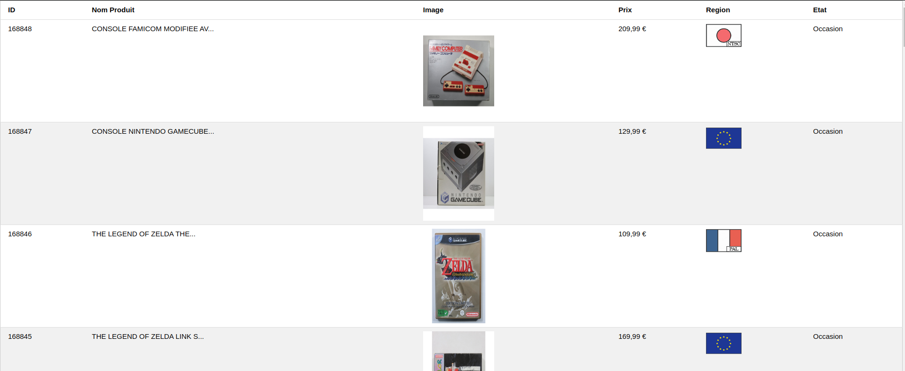

# Projet Web-Scraping

## Scrapper avec python

### Utilisation de BeautifulSoup et Pandas

Les packages pour scrapper des pages HTML : 
- BeautifulSoup
- urllib 

Le package pour travailler sur le dataset :
- pandas

## Problématique du projet  

### Site : https://www.tradergames.fr/fr/

#### La problématique du projet ici est de récupérer une certaine quantité des derniers arrivages du site via le scrapping et de vérifier la répartition des produits :  

- Provenance : répartition des régions sur les derniers arrivages
- Etats : répartition des produits Neuf et occasion sur les derniers arrivages

## Construction du dataset

#### Le dataset sera construit en récupérant les informations suivantes :  

- Id du produit
- Nom du produit
- Url de l'image du produit
- Prix du produit
- Region du produit : Zone Import
- Etat du produit : Occasion ou Neuf

#### Récupération des données - Jupyter Notebook : https://github.com/RobertoJustino/python_webscrapping/blob/main/python_scraping_trader_games.ipynb

## Enregistrement du dataset dans une base de données MySql et une application Flask

- Base de données : MySQL
- Package utilisées : Flask, Pandas, Sqlalchemy
- Vue des données : HTML, CSS


## Lancement du projet 

- télécharger le projet .zip et extraire son contenu dans un dossier 
- se mettre à la racine du projet et avec docker installé sur votre machine, rentrer dans un terminal : 
    - ```docker-compose build```
    - ```docker-compose up -d```

##### si il y a une erreur et l'application ne fonctionne pas à cause d'un problème de bdd:  
- se connecter au container mysql : ```docker exec -it <nom-du-container-db> bash```
- se connecter a mysql : ```mysql -uroot -proot``` (vous vous retrouverez dans le terminal de mysql. )
- copier coller le contenu du fichier init.sql dans le terminal
- quittez avec ```exit```

## Capture d'écran de l'application affichant le dataset




